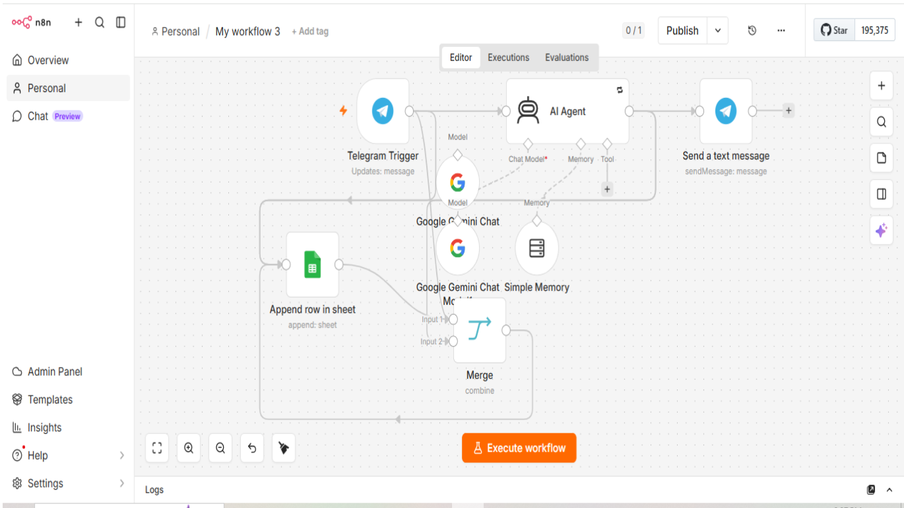

# AI Telegram Customer Support Bot with n8n & Gemini

## 🚀 Overview

An AI-powered customer support bot built with n8n, Google Gemini, Telegram Bot API, and Google Sheets.

The workflow automatically receives customer messages from Telegram, generates intelligent responses using Gemini AI, sends replies back to users, and logs every conversation into Google Sheets.

---

## 🎯 Business Problem

Many small businesses spend too much time answering repetitive customer questions manually.

---

## 💡 Solution

This automation creates an AI customer support assistant that:

- Receives customer messages from Telegram
- Generates AI responses using Google Gemini
- Sends replies instantly
- Stores conversations in Google Sheets
- Maintains conversation memory for better responses

---

## ⚙️ Technologies

- n8n
- Google Gemini AI
- Telegram Bot API
- Google Sheets

---

## ✨ Features

- AI-powered customer support
- Telegram integration
- Conversation memory
- Automatic conversation logging
- No-code automation

---

## 🎥 Demo

Coming Soon

---

## 📷 Screenshots

Coming Soon

---

## 📄 License

MIT
## 📷 Workflow

